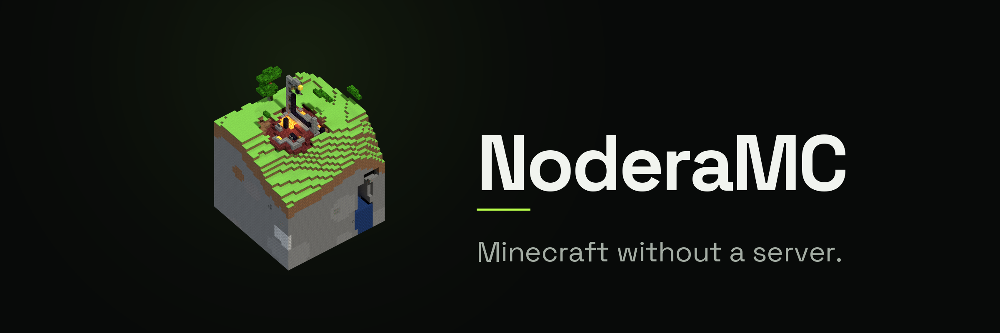

<!-- AI-AGENT-INSTRUCTION: This README is the SHOP WINDOW, not the manual. Hard cap: 200 visible
     lines. Do NOT add project layout, commit-message rules, documentation discipline, milestone
     narrative or per-limitation prose here — those live in the docs tree and MUST be read there:

       · What NoderaMC is, conventions, layering, frozen contracts, doc format .. docs/README.md
       · Central roadmap, ordering, priority, difficulty, completion figure .. docs/ROADMAP.md
       · Per-category tasks / progress / testing / limitations ............... docs/<category>/
       · Agent memory: build commands, disciplines, commit format, workflow .. AGENTS.md
       · Issue workflow (one task = one issue = one branch = one PR) ......... .github/ISSUE_SYSTEM.md
       · Programme plans .................................................... docs/plans/

     Only two things in this file are living data: the module-status table and the roadmap table.
     Update the owning docs/<category>/Task.<n>.md FIRST, then that category's PROGRESS.md /
     TESTING.md, then docs/ROADMAP.md, then the tables here — in the SAME commit as the code.
     Keep every AI-AGENT-INSTRUCTION comment intact. -->

<div align="center">

<!-- AI-AGENT-INSTRUCTION: The banner is a render, not hand art — a real Minecraft world exported to
     geometry and shaded in Blender; see the Branding section. Do not edit `branding/*.png` by hand
     and do not swap this for a drawn logo. -->


# NoderaMC

<!-- AI-AGENT-INSTRUCTION: Badges are  tags, NOT markdown ``. Some renderers treat a URL
     containing dots (build.yml, 1.21.1) as a file path and dump the raw SVG into the page; an
      tag never does. Keep the version pins in sync with library/java/build-logic (NeoForge) and
     gradle/libs.versions.toml.

     The two test badges are shields.io ENDPOINT badges reading
     https://github.com/Ashu11-A/NoderaMC/tree/badges — an orphan branch the `badges` job in
     .github/workflows/build.yml force-pushes on every run to `main`, holding the totals the `java`,
     `rust` and `companion` jobs measured (scripts/test-totals.sh). Do NOT replace them with a
     workflow-status badge: "Build · passing" is a claim about an exit code, and a job that skips
     into green renders it just as happily — the whole point of these two is that the number can
     only come from a suite that ran. Do not hand-write the numbers here either; nothing in this
     file is the source, and a hand-typed count is read as evidence. -->

<p>


</p>

<p>


</p>

<p>


</p>

<br>

<p align="center">
<strong>Minecraft without a server.</strong>
<br>
<sub>
The world is split into <strong>8×8-chunk regions</strong>; each one is simulated and validated by a
small <strong>committee of player-run peers</strong>.
<br>
Any player shares a world straight from the pause menu — <strong>"Open to Nodera"</strong> — and peers
find each other through an untrusted tracker and rendezvous relay.
<br>
<br>
No central server is required. A dedicated server, if you run one, is just a well-provisioned
archival peer with a single, non-authoritative vote.
</sub>
</p>

<p align="center">
<a href="https://github.com/Ashu11-A/NoderaMC/stargazers"></a>
<a href="https://noderamc.org/add-store?url=https%3A%2F%2Fraw.githubusercontent.com%2FAshu11-A%2FNoderaMC%2Fservices%2Findex.min.json"></a>
</p>

</div>

---

## How it works

The central bet is a **bit-for-bit deterministic region engine**. Everything downstream gates on it:
if two honest peers cannot reproduce the same `StateRoot` from the same inputs, there is nothing to
agree on. Given that, a region's committee re-executes every action, votes, and commits, so
correctness never depends on any single machine — and the infrastructure services are *verified,
never trusted*: an outage degrades discovery and reachability, never correctness.

Alongside the mod, an always-on headless **peer worker** keeps your world on the network with
Minecraft closed. A cinematic **Tauri desktop launcher** starts the game and supervises that worker;
Android runs the same worker behind a native Material You node companion.

### Play with no mod installed

<!-- AI-AGENT-INSTRUCTION: The lane described below is docs/peer/Task.7.md (the tunnel, the
     multicast detection, the control verbs) and docs/frontend/Task.7.md (the modal, the directory, the
     Join button) — both ✅ COMPLETED and live-verified. Read those before editing this copy; do NOT
     cite them inline here, the visible text stays link-free. The two claims that must never be
     softened or lost: (1) joining does NOT download the world — the tunnel carries the game's own
     TCP connection and no save is ever copied; (2) a guest names a SESSION, never an address, which
     is what stops every peer being an open proxy into its own loopback. Detection is not consent:
     nothing is announced until the player says so. -->

The companion app is also how you **browse and join NoderaMC worlds with an unmodified Minecraft**.
The host presses vanilla's own *Open to LAN*; the worker hears the multicast beacon, asks for
consent, and publishes the session. A guest browses the directory in the app, presses **Play**, and
the worker **binds a local port** while the launcher starts the selected Minecraft profile — from
Minecraft's point of view it is a server on `127.0.0.1`. Nothing is installed into either game and
**no save is ever downloaded**: the tunnel carries the game's own connection, and the host stays the
sole authority over its world.

### Import a service list

<!-- AI-AGENT-INSTRUCTION: This is app Task.9 (✅) + tracker Task.6 + mobile Task.5; the format and
     the publishing guide live on the `services` branch, which holds index.json, index.min.json and
     index.schema.json and shares no history with main. Two rules that must never be softened.
     (1) A deep link RECORDS a URL, it never adds a store and never fetches one — the app shows the
     URL and waits, because the request itself tells that address this install exists. (2) Adding is
     preview-first: `preview_tracker_store` fetches and shows what was served, and
     `add_tracker_store` is reachable only from that preview. An "add without checking" shortcut
     puts the decision back where it was. There is no privileged
     store: the bundled list is deletable like any other. The header button CANNOT be a `nodera://`
     href: GitHub's markdown sanitiser strips every scheme but http/https/mailto, so it points at
     https://noderamc.org/add-store, which is web/add-store.html deployed by
     scripts/deploy-site.sh — that page is the https hop that turns the click into the scheme. -->

Trackers and rendezvous points are **hints, not authority** — every service proves its own identity
before a peer dials it — so the app takes lists of them from anyone. Press the button above, follow
any publisher's `nodera://tracker-store?url=…` link (registered on desktop **and** Android), or
paste the address by hand under **Settings → Tracker stores**.

A link only *records* the URL: the app shows it, you decide, and nothing is fetched before you
confirm. When you do, the app reads the list and shows you what it found — the publisher's name for
it and every tracker and relay in it — **before** anything is added. The list the app ships with is
one store among however many you add, and is deletable like
any other. Publishing your own is a JSON file against the published `index.schema.json` — the
format, and how to get a service listed, are on the
[`services` branch](https://github.com/Ashu11-A/NoderaMC/blob/services/README.md).

## Quick start

Drop `build/nodera-neoforge.jar` into a **NeoForge 1.21.1** client's `mods/` folder, keep the worker
running, open a world, then press **"Open to Nodera"** in the pause menu. Or download a built one
from the [`latest` release](https://github.com/Ashu11-A/NoderaMC/releases/tag/latest) — see
[Releases](#releases) for what is published there.

```bash
scripts/dev.sh                   # build Rust + mod + worker, run tracker + rendezvous + worker
scripts/dev.sh --install-mod     # …and copy the built mod into ~/.minecraft/mods
scripts/dev.sh --with-app        # …and launch the Tauri companion app alongside the worker
scripts/dev.sh --build-only      # compile everything into build/, then exit
scripts/dev.sh --help            # all options + env overrides (ports, dirs)

# Hands-on session on one machine: 2 clients, 1 tracker, 1 rendezvous, 3 peer workers
scripts/dev.sh --play
scripts/dev.sh --play --spare-peers 0    # thin the swarm below quorum and watch it degrade
```

The mod **requires** the worker and aborts startup with an install prompt if nothing answers on
`127.0.0.1:25610` (set `companion.required = false` in `config/nodera-client.toml` to opt out).

## Branding

<!-- AI-AGENT-INSTRUCTION: `branding/` holds the delivered mark, and `layout.properties` declares it
     as `dir.branding`. Never hand-edit those PNGs, never redraw the mark, and never point an icon
     path somewhere else — the four files in `app/icons/` are the exact set `app/tauri.conf.json`
     names, and `web/public/` is what Vite copies to the site root. A new mark means a new render
     from the world in `branding/world.manifest`, cut into the same ladder. -->

The mark is not drawn. It is a 32-block cube of a real Minecraft world — a vanilla ruined portal
standing where four chunks meet, in a forest at `x -1728, z -384` of seed `8675309` on 1.21.1 —
exported to geometry and shaded in Blender with nearest-neighbour block textures, so every pixel of
it is Minecraft's own art rather than an impression of it. `branding/world.manifest` records the
seed, the biome, the portal template, the exported bounds and the camera: enough to stand in that
spot in-game and see the thing on the banner.

`branding/logo.blend` is the scene that produced it: the exported geometry, the 33 block textures
**packed into the file**, the four-part light rig, and the orthographic camera at 41.9° elevation /
142.3° azimuth. It opens standalone — no path into anyone's `build/` — and rendering it as saved
(Cycles, 2048², 512 samples, Standard view transform, transparent film) reproduces the mark. Blender
writes a `.blend1` backup beside it on every save; that one is ignored.

Everything downstream is cut from one 2048 px render, downscaled in linear light:

| Where | Files |
|---|---|
| `branding/` | `logo-{16,32,48,64,128,256,512,1024}.png`, `banner.png`, `logo.blend`, `world.manifest` |
| `app/icons/` | `32x32.png`, `128x128.png`, `icon.png` (window + tray), `icon.ico` (7 frames) |
| `web/public/` | `favicon.png`, `apple-touch-icon.png` — copied to the site root by the Vite build |
| Android | the five `mipmap-*` buckets under `app/gen/`, cut from `logo-512.png` by `scripts/android-apk.sh` — `gen/` is generated, so an APK built without that step ships Tauri's placeholder |

## Build & test

<!-- AI-AGENT-INSTRUCTION: ALWAYS run `./gradlew check` AND `cargo test` before committing; never
     commit on a red build. If a test fails and you cannot fix it, open a `bug` issue and do NOT
     commit the regression. After pushing, verify the Action actually passed (`gh run list`) — CI
     runners are slower and have repeatedly exposed timing-sensitive tests that pass locally. -->

```bash
./gradlew check                  # compile + every Java unit test (the gate)
./gradlew build                  # check + assemble jars
cargo test                       # Rust unit + cross-language conformance (equally required)
cargo fmt --check && cargo clippy --all-targets -- -D warnings

# app is a SEPARATE cargo workspace (Tauri native deps) held to the same standard
cd app && cargo test && cargo fmt --check && cargo clippy --all-targets -- -D warnings

scripts/version.sh --check       # every version mirror agrees with the root VERSION file
scripts/loc-metrics.py --check   # source size is within its stamped baseline (ratchets down only)
scripts/test-counts.sh --check   # every crate/package test count below is the measured one
scripts/test-counts.sh --check java  # …and the nine Gradle module counts, from the JUnit XML
scripts/test-totals.sh --java    # how many tests PASSED/FAILED — what the badges above show
scripts/check-layout-drift.sh    # workflow/Docker/Tauri paths still resolve
scripts/check-case-collisions.sh # no path or module that collides by case on macOS/Windows
scripts/check-docs.sh            # every docs/ link resolves; every table is square
```

**End-to-end suites** — one command over the acceptance scenarios, the benchmarks and the structural
report. Results land in `build/reports/nodera/TEST-REPORT.md`; see [`docs/testing/`](docs/testing/Task.0.md).

The **measurement lanes** take minutes, so they are not part of `check`; the `benchmarks` workflow
runs them on every pull request, on `main`, and weekly.

```bash
scripts/nodera-test.sh list      # every scenario, its tags, what a pass proves
scripts/nodera-test.sh run       # the default queue (everything but 'hardware')
scripts/nodera-test.sh all       # scenarios, then benchmarks, then structure

./gradlew :peer:benchmarkReport  # discovery / chunk sync / wire / runtime latency, ranked
./gradlew :peer:structureReport # dead code + cost findings, debugger-verified
```

Host runs JDK **25**; the project pins Java **21** and uses only Java 21-era language features.

## Releases

<!-- AI-AGENT-INSTRUCTION: The asset names here MIRROR scripts/lib/release.sh, which is the one
     naming table — do not add, rename or reorder a deliverable in this list without changing that
     file, and `scripts/release.sh --names` is what prints the authoritative set. The
     `release-manifest` job in build.yml diffs the manifest against the expected list on every push.
     Never write an asset name into .github/workflows/release.yml. -->

Every push to `main` re-cuts the rolling
[**`latest`**](https://github.com/Ashu11-A/NoderaMC/releases/tag/latest) prerelease; a `v*` tag
publishes a permanent versioned release. Both carry the same set, with `<version>` being `latest` or
the tag, and **both architectures are always built**:

| Asset | What it is |
|---|---|
| `nodera-neoforge-<version>.jar` | The NeoForge 1.21.1 mod — drop it in `mods/` |
| `nodera-paper-<version>.jar` | The Paper/Folia endpoint plugin — drop it in `plugins/` |
| `nodera-peer-<version>.jar` | The headless always-on node: `java -jar nodera-peer-<version>.jar` |
| `nodera-app-<system>-<arch>.<ext>` | The companion app installer — `linux`/`windows` × `x64`/`arm64` (`.deb`/`.msi`). No macOS build: see `NODERA_RELEASE_SYSTEMS` in `scripts/lib/release.sh` |
| `nodera-app-android-universal.apk` | The Android app, signed with the project release key. One APK carrying every ABI |
| `nodera-tracker-<arch>-<version>` | The tracker service binary — `x64` and `arm64` |
| `nodera-rendezvous-<arch>-<version>` | The rendezvous + relay service binary — `x64` and `arm64` |
| `SHA256SUMS` / `SHA256SUMS.sig` | Digests over every asset, and a detached Ed25519 signature over them |

The services' self-update lane reads `SHA256SUMS`, checking the signature **before** the digest, and
asks for its own architecture's asset by name. A release that is missing a deliverable fails the run
rather than publishing short — `scripts/release.sh --verify` is the gate, and the same script builds
the whole set locally:

```bash
scripts/release.sh --names                # every asset a complete release contains
scripts/release.sh --component jars       # the three jars (any machine with a JDK)
scripts/release.sh --component services   # this architecture's tracker + rendezvous
scripts/release.sh --component app        # this platform's installer (needs bun + Tauri deps)
scripts/release.sh --component android    # the signed APK (needs the release key; see below)
scripts/release.sh --verify               # hold build/release to the manifest
```

## Module status

<!-- AI-AGENT-INSTRUCTION: Mirrors docs/<category>/TESTING.md — update both together. Status:
     ✅ done · 🚧 partial · ⏳ in progress · ⬜ not started · ❌ failing. Keep the responsibility
     column to ONE short line; the full architecture of a module is in <module>/README.md or
     <crate>/README.md.
     EVERY row's Tests cell is measured, and none of them may be edited by hand. scripts/test-counts.sh
     parses all of them: the Gradle module rows keyed on the module NAME (`module.*` in
     layout.properties, from the JUnit XML — `--check java`, which the `java` job runs), the Rust crate
     rows and the two frontend package rows keyed on the crate or package DIRECTORY (`--check`). Do not
     change their shape (backticked key, count as the second-to-last cell), and re-stamp a real change
     with `scripts/test-counts.sh --write java` or `--write <suite>` rather than typing a number — nine
     of these were typed once and three of the nine were wrong. -->

| Module | Responsibility | Tests | Status |
|---|---|---|---|
| `core` | Domain types, JDK-only crypto, canonical encoding, certificates | 314 | ✅ |
| `engine` | Deterministic engine, consensus, committees, rule-pack SDK, palette | 450 | ✅ |
| `transport` | Append-only wire plane, socket/rendezvous carriers, authenticated handshake | 189 | ✅ |
| `storage` | Event-sourced + RocksDB tiers, checkpoints, identity/permission stores | 158 | ✅ |
| `testing` | Shared test library: loopback transport, fake regions, fixture IO, layout manifest | 46 | ✅ |
| `peer` | Peer runtime, discovery, distribution, archival, control, diagnostics, and the always-on `nodera-headless` node built from them | 850 | 🚧 |
| `endpoint` | What a Minecraft-hosting process needs to BE a node, with no Minecraft in it: the companion wire, share/join gates, world stores, lane rules, lang keys | 114 | 🚧 |
| `neoforge-mod` | `@Mod` entrypoints, host lane, live block capture, GUI, world identity | 134 | 🚧 |
| `paper-plugin` | `nodera-paper.jar` — the Paper/Folia endpoint plugin | 32 | 🚧 |
| `library/rust/nodera-codec` | Byte-exact canonical-encoding port + Ed25519 verify + tag mirror | 79 | ✅ |
| `library/rust/nodera-core` | Companion-app core, shared by both front ends: worker link, settings, stores, telemetry, the launch lane | 296 | 🚧 |
| `library/rust/nodera-service` | Shared service crate: signed directory, scoring, drain deadlines, release asset naming | 100 | ✅ |
| `tracker` | Tracker service binary — announce lifecycle, swarm registry, quotas | 111 | ✅ |
| `rendezvous` | Rendezvous + relay binary — registration, hole punch, metered circuits | 64 | ✅ |
| `telemetry` | Opt-in telemetry ingest; carries no authority, nothing in the network reads it | 87 | ✅ |
| `app` | The desktop shell: window, tray, autostart, command registration. Everything it *is* lives in `nodera-core`; the Android front end is native Compose (separate workspace) | 2 | 🚧 |
| `app/ui` | The companion app's frontend — screens, the design system, the token audit | 73 | 🚧 |
| `web` | noderamc.org: the generated site, its mirrors, the `/add-store` deep-link page | 144 | 🚧 |
| `library/ts/nodera-ui` | The shared frontend kit: the platform seam, the store link, the token audit both applications run | — | ✅ |
| `integration-tests` | Three-client quorum, failover, byzantine, cross-region, debugger | — | ⬜ |

## Roadmap

<!-- AI-AGENT-INSTRUCTION: MIRRORS docs/ROADMAP.md §1, which mirrors each docs/<category>/Task.<n>.md
     status header. The task file is the source of truth for scope; update it FIRST. Never renumber
     a category's tasks — the numbers are cited by issues and commit messages. The overall completion
     figure is NOT raw done/total and lives in docs/ROADMAP.md §1, not here. -->

| Category | Scope | Tasks | Status |
|---|---|---|---|
| [**Engine**](docs/engine/Task.0.md) | Deterministic region engine, shadow validation, committees, fallback | 12 | 🚧 7 done |
| [**Network**](docs/network/Task.0.md) | Wire protocol, transports, peer runtime, storage, discovery, replication | 14 | 🚧 11 done |
| [**Tracker**](docs/tracker/Task.0.md) | Always-on world/peer discovery service + its Java client | 6 | 🚧 5 done |
| [**Rendezvous**](docs/rendezvous/Task.0.md) | NAT reach: registration, hole punching, encrypted relay fallback | 6 | 🚧 4 done |
| [**Minecraft**](docs/minecraft/Task.0.md) | The NeoForge mod: capture, live lanes, GUI, host lane, world identity | 11 | 🚧 5 done |
| [**Peer**](docs/peer/Task.0.md) | The required always-on headless peer + its loopback control protocol | 8 | 🚧 6 done |
| [**Frontend**](docs/frontend/Task.0.md) | Every user-facing surface: desktop launcher, the Android build running the same Java worker, and the website | 20 | 🚧 10 done |
| [**Telemetry**](docs/telemetry/Task.0.md) | Consented, de-identified measurement + the Big Data plane | 3 | 🚧 1 done |
| [**Server**](docs/server/Task.0.md) | The Paper/Folia endpoint plugin | 10 | ⬜ 0 done |

## Documentation

- [`docs/README.md`](docs/README.md) — entry point: what NoderaMC is, conventions, frozen contracts
- [`docs/ROADMAP.md`](docs/ROADMAP.md) — the single central roadmap, with delivery order and the
  overall completion figure; `docs/<category>/` holds tasks, progress, testing and limitations
- [`AGENTS.md`](AGENTS.md) — agent memory: build commands, layering rules, the commit standard
- [`.github/ISSUE_SYSTEM.md`](.github/ISSUE_SYSTEM.md) — how work is tracked, and the normative
  contribution rules: one task = one issue = one branch = one PR, never merged on a red build

Every package also carries its own `README.md` describing that package's architecture
(`java/<module>/README.md`, `<crate>/README.md`).
