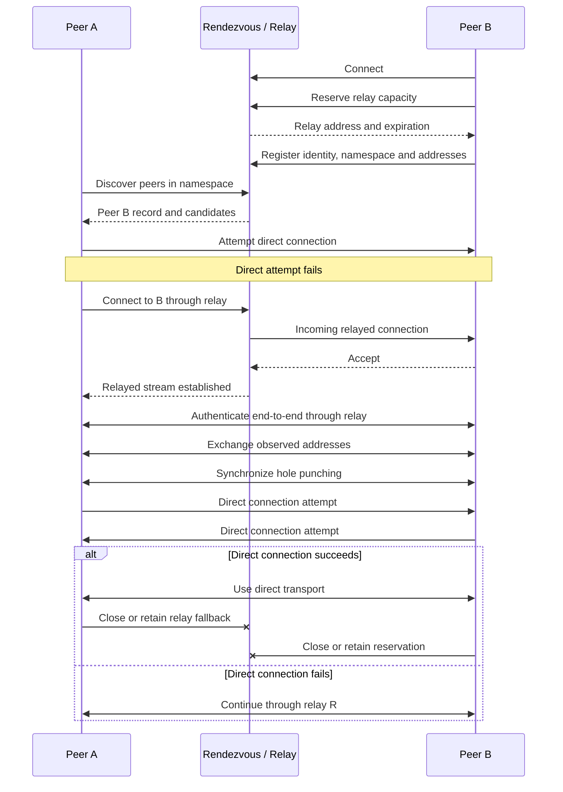

# Rendezvous and Relay Architecture

> **Reference spec** — implemented for Nodera by **[Task 4](../Task.4.md)** (legacy [Task 29](../old/Task.29.md))
> (`rust/nodera-rendezvous` + `java/transport-rendezvous`, on the [Task 27](../old/Task.27.md)
> monorepo foundation). Binding protocol and architecture decisions live in the task file; this
> document is the background architecture study it draws on.

## 1. Overview

A **rendezvous relay architecture** uses one or more publicly reachable nodes to help peers discover and connect to each other across the Internet.

The term often combines two separate responsibilities:

* **Rendezvous:** discovers peers and coordinates connection establishment.
* **Relay:** forwards application traffic when peers cannot communicate directly.

A server may implement both responsibilities, but they should remain logically separate. A rendezvous service does not necessarily relay traffic, and a relay does not necessarily discover peers.

In a well-designed P2P system, the preferred communication path is:

```text
Peer A <----------------------> Peer B
               Direct
```

The relay is normally used only during connection establishment or when a direct path is impossible:

```text
Peer A <------> Relay <------> Peer B
```

This architecture is necessary because many peers are located behind:

* Network Address Translation, or NAT;
* carrier-grade NAT;
* stateful firewalls;
* routers that reject unsolicited inbound connections;
* networks with dynamically changing addresses;
* browser or mobile networking restrictions.

STUN can help an endpoint discover the public address and port assigned by its NAT, but it is only a building block rather than a complete traversal system. ICE combines candidate discovery, candidate exchange, connectivity checks, and relay candidates to select a usable communication path. TURN provides the actual relay path when direct communication is impossible.

---

## 2. Terminology

### 2.1 Peer

A **peer** is an application instance participating in the P2P network.

A peer normally has:

* a persistent or temporary cryptographic identity;
* one or more network addresses;
* a list of supported transports;
* a list of supported application protocols;
* a set of capabilities or services;
* an active set of direct or relayed connections.

Examples include a desktop client, mobile client, browser tab, game server process, or headless seeder.

### 2.2 Rendezvous point

A **rendezvous point** is a publicly reachable service through which peers announce their presence and discover other peers.

A peer may register information such as:

```text
Peer identity
Namespace or room
Supported protocols
Direct addresses
Observed public addresses
Relay addresses
Capabilities
Registration expiration
Signed peer record
```

In libp2p’s rendezvous protocol, peers register themselves in application-specific namespaces, and other peers query those namespaces. Registrations can contain signed peer records so recipients can validate that the record was produced by the peer it describes.

The rendezvous point belongs to the **discovery and coordination plane**. It should not automatically be considered part of the application’s data path.

### 2.3 Relay

A **relay** is an intermediary that transports traffic between peers.

Instead of establishing:

```text
Peer A -> Peer B
```

the network establishes:

```text
Peer A -> Relay -> Peer B
```

TURN is the standardized relay mechanism commonly used with ICE and WebRTC. In libp2p, the comparable mechanism is Circuit Relay. TURN exists specifically for situations in which NAT behavior or firewall policy prevents a direct path between peers.

### 2.4 Signaling

**Signaling** is the exchange of the metadata needed to establish a connection.

It can include:

* peer identities;
* transport candidates;
* addresses and ports;
* protocol versions;
* session credentials;
* relay addresses;
* hole-punching synchronization messages.

Signaling is not the same as transporting application data.

### 2.5 Candidate

A **candidate** is a potential network endpoint through which a peer might be reachable.

Common candidate categories are:

| Candidate        | Description                                                      |
| ---------------- | ---------------------------------------------------------------- |
| Host             | A local interface address, such as a LAN IP                      |
| Server-reflexive | The public address and port observed through a STUN-like service |
| Port-mapped      | An address explicitly mapped through UPnP, NAT-PMP or PCP        |
| Relay            | An address allocated or reserved on a relay                      |
| Public           | A directly reachable public address                              |

ICE gathers and tests candidate pairs before nominating a path for the session.

### 2.6 Hole punching

**Hole punching** attempts to create a direct path through NAT devices by coordinating outbound connection attempts from both peers.

Because both devices see outbound traffic, their NATs may temporarily permit the corresponding inbound packets.

Hole punching does not always succeed. Its result depends on NAT mapping behavior, firewall policy, transport, address prediction, timing and network topology.

### 2.7 Bootstrap node

A **bootstrap node** provides an initial entry point into the network.

It may tell a new peer where to find:

* rendezvous points;
* DHT members;
* relay providers;
* pub/sub peers;
* other bootstrap nodes.

A bootstrap node and a rendezvous point can be the same process, but they solve different problems:

```text
Bootstrap: How do I enter the network?
Rendezvous: Which peers should I connect to?
Relay: How can packets reach a peer that is not directly reachable?
```

---

## 3. Logical Components

A complete deployment can be divided into three planes.

## 3.1 Discovery plane

The discovery plane locates peers.

Possible implementations include:

* rendezvous servers;
* distributed hash tables;
* BitTorrent-style trackers;
* DNS records;
* multicast DNS for local networks;
* peer exchange;
* pub/sub membership;
* static bootstrap lists.

A rendezvous service is especially useful when peers must discover others belonging to a particular namespace:

```text
/game/server-42
/document/8fb31
/world/europe-west
/protocol/my-application/1
```

## 3.2 Connectivity-control plane

The connectivity-control plane determines how two discovered peers can communicate.

It performs tasks such as:

1. exchanging candidates;
2. discovering external addresses;
3. testing candidate pairs;
4. coordinating simultaneous connection attempts;
5. authenticating peer identities;
6. selecting direct or relayed transport;
7. upgrading an existing relayed connection.

ICE is an example of this kind of connectivity procedure. In libp2p, Identify, AutoNAT, Circuit Relay and DCUtR collectively provide comparable capabilities.

## 3.3 Data plane

The data plane carries application traffic.

It may use:

* direct TCP;
* direct QUIC;
* WebRTC data channels;
* WebTransport;
* WebSocket;
* relayed TCP or UDP;
* a libp2p circuit.

The data plane should prefer direct connectivity because direct connections normally reduce:

* latency;
* relay bandwidth costs;
* centralized infrastructure dependency;
* relay congestion;
* failure exposure.

---

## 4. Connection Lifecycle

Consider two peers:

```text
A — peer attempting to initiate a connection
B — peer that may be behind NAT
R — public rendezvous and relay node
```

## 4.1 Peer startup

Peer B starts and creates or loads its cryptographic identity.

It then:

1. opens local listening transports;
2. gathers local addresses;
3. determines whether it is publicly reachable;
4. discovers its externally observed address;
5. finds one or more relays;
6. optionally reserves relay capacity;
7. registers itself with a rendezvous point.

Conceptually:

```text
B -> R: REGISTER {
  namespace: "my-network",
  peerId: B,
  directCandidates: [...],
  relayCandidates: [...],
  capabilities: [...],
  expiresAt: ...
}
```

Registrations should expire automatically. B periodically refreshes its registration while it remains online.

## 4.2 Relay reservation

When B cannot reliably accept direct inbound connections, it reserves resources on relay R.

```text
B -> R: RESERVE
R -> B: RESERVATION_ACCEPTED {
  relayAddress,
  expiration,
  limits,
  proof
}
```

B can now advertise an address meaning:

```text
Reach B through relay R
```

In libp2p Circuit Relay v2, a peer explicitly reserves a relay slot. The relay can impose expiration, duration and data limits, preventing open relays from being consumed without bounds.

A conceptual libp2p-style address resembles:

```text
/p2p/<relay-peer-id>/p2p-circuit/p2p/<destination-peer-id>
```

This address identifies both the relay and the final destination.

## 4.3 Peer discovery

Peer A queries the rendezvous service:

```text
A -> R: DISCOVER {
  namespace: "my-network"
}
```

R responds with records for matching peers:

```text
R -> A: PEERS [
  {
    peerId: B,
    directCandidates: [...],
    relayCandidates: [...],
    capabilities: [...]
  }
]
```

The rendezvous point has introduced A to B, but it has not necessarily created a connection between them.

## 4.4 Direct connection attempt

A should first attempt B’s direct candidates.

```text
A -> B: direct connection attempt
```

If B has a public address, explicit port mapping, compatible NAT mapping, or an existing reachable listener, this may succeed immediately.

After the transport connection is created, A and B authenticate each other using their expected identities.

The address obtained from rendezvous must not itself be treated as proof of identity. The transport handshake must verify that the remote endpoint actually owns B’s expected cryptographic identity.

## 4.5 Initial relay connection

When direct dialing fails, A uses B’s relay address:

```text
A -> R: CONNECT_TO(B)
R -> B: INCOMING_CONNECTION_FROM(A)
B -> R: ACCEPT
R: bridge A and B
```

The resulting path is:

```text
A <============> R <============> B
       leg 1             leg 2
```

A and B should still establish an end-to-end authenticated and encrypted session over the relayed transport.

The relay may be able to observe metadata such as:

* source and destination identities;
* connection time;
* transferred byte counts;
* traffic timing;
* relay reservation information.

With end-to-end encryption, it should not be able to understand or modify application payloads without detection.

## 4.6 Direct connection upgrade

Once A and B have a working relayed connection, they can use it as a reliable signaling channel for hole punching.

They exchange:

```text
A -> B through R: my observed addresses
B -> A through R: my observed addresses
A <-> B through R: synchronization
A -> B directly: simultaneous attempt
B -> A directly: simultaneous attempt
```

This design is useful because the peers already have:

* a communication channel;
* authenticated identities;
* a mechanism for exchanging addresses;
* a fallback path if the direct attempt fails.

Libp2p’s DCUtR protocol follows this model: peers begin with a relayed connection, exchange observed addresses, synchronize their attempts, and upgrade to a direct connection if hole punching succeeds. If it fails, they continue using the relay.

## 4.7 Path selection

The connection manager evaluates available paths.

A typical priority order is:

```text
1. Direct local-network connection
2. Direct public QUIC connection
3. Direct public TCP connection
4. Hole-punched QUIC connection
5. Hole-punched TCP connection
6. Relayed connection
```

The exact ordering depends on the application.

For example, a real-time game might prefer the path with the lowest measured latency, while a file-transfer application might prioritize throughput and stability.

## 4.8 Relay shutdown or retention

After the direct connection becomes stable, the peers can:

* close the relay connection;
* retain it briefly as a fallback;
* keep a lightweight relay reservation;
* periodically verify direct connectivity;
* migrate back to the relay if the network changes.

Mobile peers should expect addresses to change when switching between Wi-Fi and cellular networks.

---

## 5. Sequence Diagram



---

## 6. Abstract Protocol Model

The following interfaces describe a generic protocol rather than a specific standard:

```ts
type PeerId = string;
type Namespace = string;

type Transport =
  | "tcp"
  | "quic"
  | "webrtc"
  | "webtransport"
  | "websocket"
  | "relay";

interface PeerCandidate {
  transport: Transport;
  address: string;
  priority: number;
  kind: "host" | "public" | "server-reflexive" | "mapped" | "relay";
}

interface SignedPeerRecord {
  peerId: PeerId;
  publicKey: string;
  namespace: Namespace;
  candidates: PeerCandidate[];
  capabilities: string[];
  issuedAt: number;
  expiresAt: number;
  signature: string;
}

interface RegisterRequest {
  type: "register";
  record: SignedPeerRecord;
}

interface DiscoverRequest {
  type: "discover";
  namespace: Namespace;
  cursor?: string;
  limit?: number;
}

interface DiscoverResponse {
  type: "discover-response";
  peers: SignedPeerRecord[];
  cursor?: string;
}

interface RelayReservation {
  relayPeerId: PeerId;
  destinationPeerId: PeerId;
  relayAddress: string;
  expiresAt: number;
  maxDurationMs?: number;
  maxBytes?: number;
  proof?: string;
}

interface ConnectionAttempt {
  localPeerId: PeerId;
  remotePeerId: PeerId;
  candidates: PeerCandidate[];
  preferredTransports: Transport[];
}
```

A production protocol must also define:

* serialization;
* message size limits;
* version negotiation;
* signature format;
* replay protection;
* expiration behavior;
* error codes;
* rate limits;
* authentication requirements;
* candidate filtering;
* connection state transitions.

---

## 7. State Machine

A peer connection can be represented as:

```text
DISCONNECTED
    |
    v
DISCOVERING
    |
    v
DIRECT_DIALING
    | success
    +--------------------------> DIRECT
    |
    | failure
    v
RELAY_DIALING
    | success
    v
RELAYED
    |
    v
HOLE_PUNCHING
    | success
    +--------------------------> DIRECT
    |
    | failure
    v
RELAYED
```

Additional transitions are needed when:

* the direct path stops responding;
* the relay reservation expires;
* the peer changes networks;
* authentication fails;
* a better path becomes available;
* the rendezvous record becomes stale.

---

## 8. Security Model

## 8.1 Cryptographic peer identity

Each peer should have a cryptographic identity derived from or bound to a public key.

All peer records should be signed.

When A discovers a record claiming to describe B, A should verify:

```text
record.peerId matches record.publicKey
record.signature is valid
record has not expired
record namespace is acceptable
record capabilities are permitted
```

The rendezvous service should not be trusted to authenticate application messages on behalf of peers.

## 8.2 End-to-end transport security

The P2P connection must be encrypted and authenticated between A and B, even when the path passes through R.

```text
Transport legs:
A <-> R
R <-> B

End-to-end session:
A <====================> B
```

Encrypting only the individual relay legs allows R to read the traffic. An additional end-to-end secure session prevents this.

## 8.3 Registration abuse

A malicious client may attempt to:

* register another peer;
* publish forged addresses;
* create many registrations;
* register in every namespace;
* keep stale records alive;
* advertise private or malicious endpoints.

Mitigations include:

* self-registration only;
* signed records;
* registration TTL;
* namespace authorization;
* per-identity quotas;
* per-IP quotas;
* proof-of-work or payment for hostile public networks;
* address validation;
* record-size limits.

## 8.4 Relay abuse

An unrestricted relay can be abused as:

* a bandwidth proxy;
* a denial-of-service amplifier;
* an anonymity layer for attacks;
* an illegal-content transport;
* a resource-exhaustion target.

Relay services should enforce:

```text
Reservation limits
Connection limits
Bandwidth limits
Maximum circuit duration
Maximum bytes per circuit
Authentication
Destination permissions
Rate limits
Idle timeouts
Abuse monitoring
```

Circuit Relay v2 introduced explicit reservations and limited relaying partly because unrestricted public relays are expensive and vulnerable to oversubscription.

## 8.5 Metadata privacy

Even when payloads are encrypted, rendezvous and relay operators may learn:

* that two peers are communicating;
* when they connected;
* their apparent network addresses;
* their namespace membership;
* approximate traffic volume.

For sensitive systems, use:

* multiple rendezvous providers;
* short-lived peer identifiers;
* minimized registration metadata;
* encrypted namespace identifiers;
* relay rotation;
* private discovery tokens;
* application-level access control.

---

## 9. Reliability and Scaling

## 9.1 Multiple rendezvous points

Clients should not depend on a single rendezvous point.

A resilient configuration uses:

```text
Rendezvous R1
Rendezvous R2
Rendezvous R3
DHT or peer exchange fallback
```

Peers can register with several rendezvous points and merge their discovery results.

Because rendezvous traffic primarily consists of registration and discovery metadata, these services are usually easier to scale than relays.

## 9.2 Relay pools

Relay bandwidth scales with actual application traffic.

For this reason, relays should be deployed as a pool:

```text
Relay Europe 1
Relay Europe 2
Relay Americas 1
Relay Americas 2
Relay Asia 1
```

Peers can select relays using:

* latency;
* geographic proximity;
* available capacity;
* transport compatibility;
* trust policy;
* reservation success;
* measured reliability.

## 9.3 Expiring state

Rendezvous registrations and relay reservations should use leases rather than permanent state.

```text
Register
Receive expiration
Refresh before expiration
Remove state when refresh stops
```

This allows crashed or disconnected peers to disappear automatically.

## 9.4 Keepalives

NAT mappings and stateful firewall entries can expire during inactivity.

Active connections may therefore require periodic keepalives. STUN supports connectivity checks and keepalive behavior, while ICE requires endpoints to maintain the bindings associated with active sessions.

Keepalive intervals should be configurable because aggressive intervals consume mobile battery and bandwidth.

---

## 10. Common Deployment Patterns

### 10.1 Rendezvous only

```text
A -> Rendezvous <- B
A <-------------> B
```

Use this when most peers are publicly reachable or direct traversal is handled by another protocol.

### 10.2 Rendezvous with relay fallback

```text
Discovery:
A -> Rendezvous <- B

Preferred data path:
A <-------------> B

Fallback:
A <-> Relay <-> B
```

This is the most common general-purpose architecture.

### 10.3 Relay-first connection upgrade

```text
A <-> Relay <-> B
        |
        | signaling and synchronization
        v
A <-------------> B
```

This is useful when a relayed connection is easy to establish and can subsequently coordinate hole punching.

DCUtR uses this model.

### 10.4 Permanently relayed clients

Some clients may never support direct inbound communication, including restricted browser environments or devices inside strict corporate networks.

Their normal path remains:

```text
Client <-> Relay <-> Network
```

### 10.5 Decentralized rendezvous

Rendezvous does not have to be a single central server.

Possible designs include:

* several independent rendezvous nodes;
* rendezvous nodes federated through pub/sub;
* DHT-backed registrations;
* peer exchange;
* application-operated regional rendezvous nodes.

The libp2p specification explicitly allows any compatible node to act as a rendezvous point and describes using multiple daemons rather than one fragile centralized component.

---

## 11. Comparison with Similar Components

| Component                 | Discovers peers | Coordinates connection | Relays data |
| ------------------------- | --------------: | ---------------------: | ----------: |
| Bootstrap node            |       Partially |                     No |          No |
| BitTorrent tracker        |             Yes |              Minimally |  Usually no |
| DHT                       |             Yes |                     No |          No |
| STUN server               |              No |        Helps traversal |          No |
| Signaling server          |       Sometimes |                    Yes |          No |
| Rendezvous point          |             Yes |              Sometimes |  Usually no |
| TURN server               |              No |           Supports ICE |         Yes |
| libp2p Circuit Relay      |              No |    Can support upgrade |         Yes |
| Combined rendezvous relay |             Yes |                    Yes |         Yes |

A BitTorrent tracker is therefore closer to a rendezvous service than to a relay. It tells peers about one another, but normal piece transfers happen directly between peers.

---

## 12. Design Recommendations

A production implementation should follow these principles:

1. **Separate discovery from transport.**
   Peer discovery records should not imply that application traffic must pass through the rendezvous service.

2. **Attempt direct connectivity first or upgrade as soon as possible.**
   Relaying should remain a fallback unless the product intentionally requires mediated communication.

3. **Always provide a working relay path before depending on hole punching.**
   Hole punching is an optimization, not a guaranteed transport.

4. **Authenticate peers end to end.**
   Never trust an IP address, rendezvous response, or relay connection as proof of peer identity.

5. **Use expiring registrations and reservations.**
   Permanent records become stale and create unbounded state.

6. **Limit relay resources.**
   Relays require strict quotas, admission control and observability.

7. **Support multiple rendezvous and relay nodes.**
   A single public intermediary creates a failure and censorship point.

8. **Preserve connections across path changes where possible.**
   QUIC connection migration or an application-level reconnection protocol can reduce disruption.

9. **Do not expose unnecessary private addresses.**
   Candidate exchange should consider local-network information leakage.

10. **Measure path quality continuously.**
    Latency, packet loss, throughput and connection stability should determine whether a path remains preferred.

---

## 13. Summary

A rendezvous relay architecture solves three distinct P2P networking problems:

```text
Discovery:
How does Peer A find Peer B?

Traversal:
How can A and B establish a path through NATs and firewalls?

Fallback:
How can A and B communicate when no direct path works?
```

The rendezvous service answers the first question.

STUN-like address discovery, candidate exchange, connectivity checks and hole punching answer the second.

The relay answers the third.

The complete lifecycle is:

```text
Register
   ->
Discover
   ->
Exchange candidates
   ->
Attempt direct connection
   ->
Establish relay fallback
   ->
Coordinate hole punching
   ->
Upgrade to direct connection when possible
   ->
Return to relay if the direct path fails
```

The most important architectural rule is that a rendezvous point introduces peers, while a relay transports packets. Combining them in one deployment is convenient, but treating them as separate logical services produces a more scalable, secure and decentralized system.
